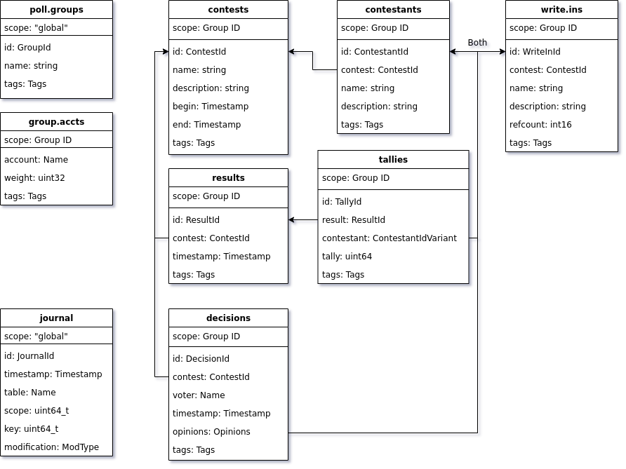
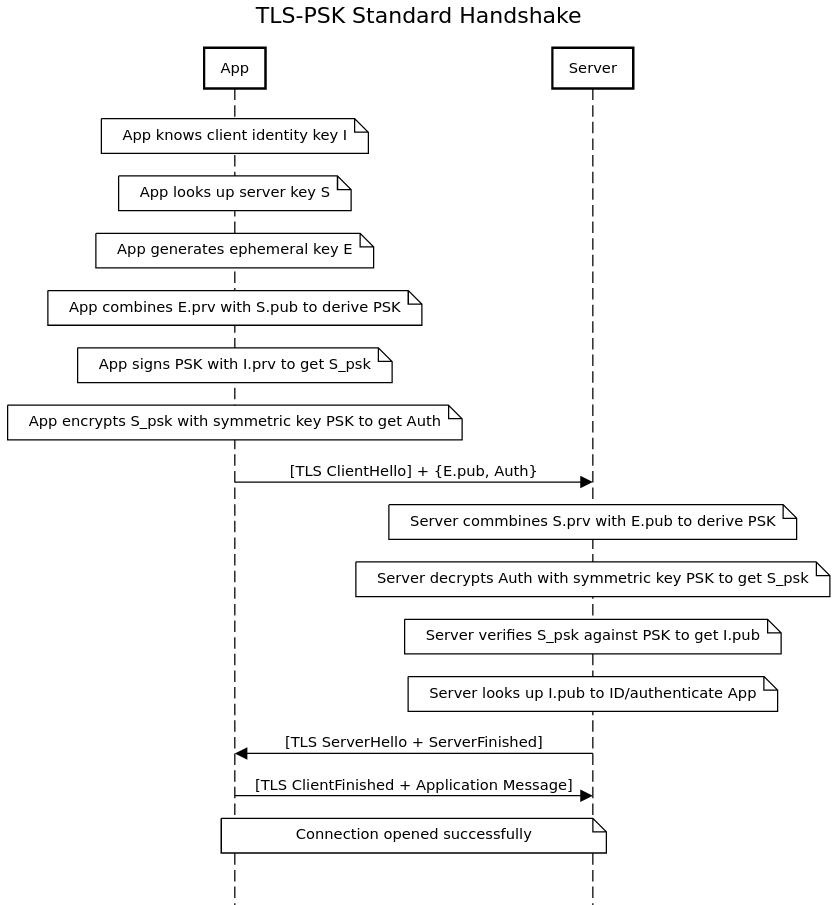
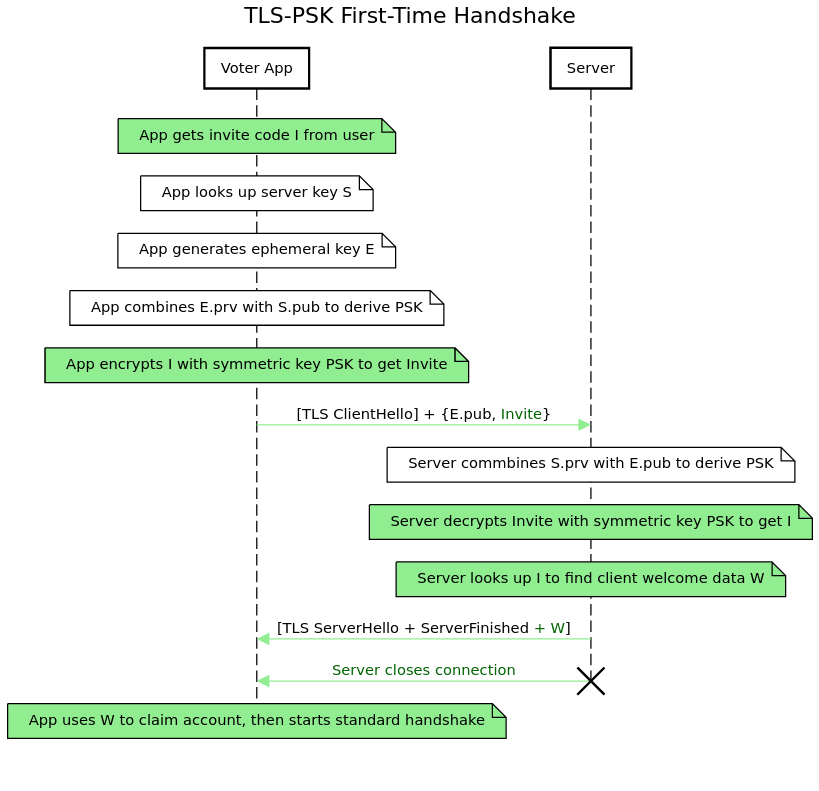

Polling on Antelope
================

[[_TOC_]]

This document describes the technical design of Follow My Vote’s initial polling system on Antelope blockchains, dubbed Pollaris. Pollaris will provide centrally administered polling on private Antelope blockchains based on manually verified identities.

As a polling system, Pollaris allows users to cast votes on various issues, questions, or propositions. Within the Pollaris implementation, the various items users may vote on are called *contests*. The Pollaris system is managed by a *polling admin* who is responsible for adding voters to the blockchain and assigning them to *polling groups* so that they may vote on contests. A contest belongs to a polling group, which is the group of accounts that may vote on that contest. Each contest has a name, description, and several *contestants*, which are the individual options a voter can distinguish between in their vote. Each contestant belongs uniquely to a specific contest and has a name and a description. User votes are called *decisions*. A decision references a particular contest and contains several *opinions* which each record the user’s response to one of the contestants. Decisions may also specify opinions about *write-in contestants* which were not among the original contestants but are specified by the voter.

All records within Pollaris have an additional property called *tags*. The tags are a free-form set of strings which can be used in future releases to add additional data to these records and support new features without modifying the database schema.

The polling admin assigns a positive integer *weight* to each voter which can be used to give particular voters within a polling group more or less weight than others. The weights are set on a group-by-group basis so if a given voter is in several polling groups, his weight may be different in each one.

Voters with a weight of greater than one are allowed to split their voting weight across multiple contestants, unless prohibited by the contest rules, by specifying opinions about the several contestants they wish to support. The sum of the voter's opinions must equal the voter's weight. Opinions with a non-positive value are not permitted.

Pollaris will be implemented in three parts: back-end smart contracts in the Antelope VM, front-end applications for administration and voting, and support servers. The smart contracts will manage a database within the VM, the front-ends will be written as local C++ GUI applications based on the Qt/QML GUI technology stack, and the support servers will be written in C++ and Boost.

## The Back-End

The back-end of Pollaris will be implemented in the Antelope VM as a set of Actions and a Database. The Actions will be invoked using transactions to make modifications to the Database. The Database can only be modified by the defined Actions, and the Actions can only be run by publishing a transaction to the chain.

We first examine the Database, followed by the Actions.

### The Database

One of the main value propositions of Antelope blockchains is the decentralized database. Contracts in the VM can store data in this database, and many public blockchain API endpoints exist which will provide data from this database when queried. As a result, it will not be necessary to create or run a custom server for Pollaris; front-ends can fetch the data they need from the free public API nodes.

Tables in the database are divided into sections, called *scopes*, to support parallel execution of operations which use different scopes. Although parallel execution is not yet implemented in EOS, the scopes feature still exists and costs nothing to use, thus it makes sense to support it.

Pollaris will partition the tables containing contest and contestant data into scopes based on their polling group. This theoretically allows parallel modification of data belonging to different polling groups, but requires modifications relating to data within the same group to be serialized.

#### Tables

The diagram below shows the tables which comprise the Pollaris database. The types used are generally defined by the C++ language or the Antelope environment, but the following types are defined within the contract as follows:

 - The `*Id` types are 64-bit unsigned integers
 - `Tags` is a set of strings
 - `ContestantIdVariant` is a variant between `ContestantId` and `WriteInId`
 - `Opinions` is a map from `ContestantIdVariant` to a 32-bit signed integer
 - `ModType` is an enumeration between `addRow`, `modifyRow`, and `deleteRow`

The `journal` table will be at global scope and provides a modification journal for all other tables. Whenever any other table is modified, whether by adding, removing, or updating a row, an entry will be made in `journal` recording the modification. This is to support GUI front-ends, which must download table data and keep it cached on the client. They need to be able to update their caches as the back-end database changes, and having the journal allows them to determine which data has been invalidated and to selectively refresh only the stale data rather than having to repeatedly download entire tables whether they have been updated or not. Because the journal is only needed for maintaining active caches, journal entries will be deleted after 12 hours to limit the growth of the table.

The `poll.groups` table will be at global scope and defines the IDs of the polling groups, and assigns them a name and tag list. All further tables will be scoped on the ID of the polling group they belong to.

The `group.accts` table records the voter accounts belonging to each polling group, and stores the voter’s name, weight value within that polling group, and a tag list.

The `contests` table contains the base information about each contest, including its database-defined ID, name, description, tags, and begin/end dates. The contestants are defined in the `contestants` table, which stores a database-defined ID, the ID of the owning contest, the contestant's name and description, and tags.

Each contest can have multiple official result tallies, and each result tally has a total vote weight for each contestant. Thus the results tables mirror the contest tables, with the `results` table defining the result sets available for each contest and the `tallies` table storing each contestant's tally numbers for each result set.

The `results` table contains the database-defined ID for the result, the ID of the contest it applies to, the timestamp at which it was tallied, and a tag list. The `tallies` table contains a database-defined ID for the tally, the ID of the result it belongs to, the ID of the contestant whose tally it records (either standard or write-in contestant), the tally of the votes for that contestant at the time of the tally, and a tag list.

Voter decisions are stored in the `decisions` table, which contains the decision’s database-defined ID, the ID of the contest, the voter account’s name, and the voter’s opinions.

Write-in contestants from the voter decisions are stored in the `write.ins` table. This table contains the database-defined write-in contestant ID, the contest ID, the contestant’s name and description, tags, and a reference count which stores the number of decisions or tallies referencing this particular write-in contestant. Write-in contestants are deleted when their reference count reaches zero.

#### Indexes
All of the tables will use their database-defined 64-bit ID as their primary key, except for the `group.accts` table which uses the voter name as its primary key. The following secondary indexes will also be defined:

 - `poll.groups`
   - Lookup by group name (first 32 characters only)
     - `name`
 - `contestants`
   - Lookup by contest ID, ordered by contestant ID
     - `contest`
     - `id`
 - `write.ins`
   - Lookup by contest ID, ordered by write-in ID
     - `contest`
     - `id`
 - `results`
   - Lookup by contest ID, ordered by most recent
     - `contest`
     - `time` (Descending)
 - `tallies`
   - Lookup by result ID, ordered by highest tally amount, then contestant ID
     - `result`
     - `tally` (Descending)
     - `contestant`
 - `decisions`
   - Lookup by contest ID, ordered by voter account name
     - `contest`
     - `voter`
   - Lookup by voter name, ordered by most recent
     - `voter`
     - `time` (Descending)
 - `journal`
   - Lookup by timestamp
     - `timestamp`

Although Antelope blockchains do not support composite keys directly, the necessary effect can be implemented by concatenating the numeric fields into larger bit-width keys. String keys are also not supported, but can be simulated by placing the first 32 characters of the string into a 256-bit checksum type.

### The Actions

Entries in the database can only be modified by code running within the blockchain VM. This code defines “actions” which are essentially program routines which can be run by broadcasting a transaction which invokes specified actions. Pollaris will define the following actions:

 - `voter.add(string groupName, Name voter, uint32 weight, Tags tags)`
   - Add a voter to the polling group with the specified name.
   - If any contests exist for the polling group, the change is rejected.
   - If the polling group does not already exist, it will be created.
   - If the voter is already in the group, but with a different weight or tags, it will be updated
 - `voter.remove(string groupName, Name voter)`
   - Remove a voter from the polling group with the specified name.
   - If any contests exist for the polling group, the change is rejected.
   - Even if the polling group is empty after removing the voter, it will be preserved along with all contest data within it.
 - `group.copy(string groupName, string newName)`
   - Make a copy of an existing polling group, giving the copy a new name.
   - The new group's name must not already be used by another group.
   - The new group has no contests and therefore is inactive and mutable.
 - `group.rename(string groupName, string newName)`
   - Rename a polling group to a new name.
   - The new name must not already be taken by another group.
   - This works even if contests exist for the group.
 - `cntst.new(GroupId groupId, string name, string description, vector<ContestantDescriptor> contestants, Timestamp begin, Timestamp end, Tags tags)`
   - Create a new contest.
   - Add the contest and contestants to their respective tables.
 - `cntst.modify(GroupId groupId, ContestId contestId, optional<string> newName, optional<string> newDescription, optional<Tags> newTags, vector<ContestantId> deleteContestants, vector<ContestantDescriptor> addContestants, optional<Timestamp> newBegin, optional<Timestamp> newEnd)`
   - Modify an existing contest.
   - Make modifications to the contest and/or contestants.
   - A contest may only be modified before it begins.
 - `cntst.delete(GroupId groupId, ContestId contestId)`
   - Delete an existing contest, and associated contestants and write-ins, decisions, results, and tallies.
   - This is a permanent change, the deleted data cannot be recovered.
 - `cntst.tally(GroupId groupId, ContestId contestId)`
   - Generate an official result for an existing contest.
   - Create counters for all contestants and write-ins for the contest. Visit all decisions on the contest, and if the decision time is within the contest period, add the voter’s weight to the selected contestant’s counter. Add the result to the results table. Store the counter totals in the tallies table.
 - `dcsn.set(GroupId groupId, ContestId contestId, Name voterName, FullOpinions opinions, Tags tags)`
   - Set a particular voter’s decision on a contest.
   - Require current time be within contest period.
   - Add or remove write-in contestants as necessary.
   - If the opinions are empty, expect an existing decision and delete it.
     - Except if the abstain tag is set on the decision, then store a decision with no opinions
   - Store or update the decision, verifying the existence of contestants.

In the above, the `ContestantDescriptor` type is a struct containing a name string, a description string, and a string set of tags. `FullOpinions` is a struct containing a map of `ContestantId` to a 32-bit integer, and a map of `ContestantDescriptor` to a 32-bit integer (for write-in contestants).

Of the above actions, the contest actions (`cntst.*`) and the polling group actions (`voter.*`) require the contract’s authority to execute; only the contract account (i.e. Follow My Vote) can create, modify, delete, or tally contests, or modify polling groups. The `dcsn.set` action requires the authority of the voter specified by the decision.

## The User Interfaces
The first front-end for Pollaris is for polling admins, and allows a user to create and manage polling groups, including the creation of new voter accounts on the blockchain, and to create and manage polls accessible to their respective polling groups. The second front-end is a voter interface, allowing voters to claim their account on the blockchain, see which polling groups they are members of, see the contests available to them through those polling groups, and manage their decisions on those contests. These front-end applications will be created as locally-installed native applications written in C++ and utilizing Qt/QML as the GUI technology. Both front-end applications will be supported on mobile as well as desktop devices.

Although the front-ends are distinct applications, they will share much of their underlying technology, differing primarily in what functionality is available to their respective users, and so they are described together in this section.

### The Pollaris Assistant
On-boarding, or the process of initially introducing new users to the application, and in-app support are key elements of the Pollaris user experience. Many applications have experimented with myriad strategies for solving these problems, and most are inadequate, leaving users confused or unaware of critical features and functionality within the app, or annoying to the users giving them a bad experience with the software. This issues are particularly prevalent in the Blockchain and Decentralized technology industry, where users are frequently expected to have a level of technical knowledge uncommon to many non-technical people.

To address these issues, Follow My Vote has opted to create a visual "Assistant" within the applications that serves to introduce the user to the app and be available to support them throughout their usage of the application. The Assistant will be visually represented using the Follow My Vote logo, and will be on-screen throughout the execution of the application. The Assistant will not be permanently embedded into any of the application screens, but instead will be dynamic and mobile, able to move freely about the application interface and even on the desktop outside of the application window. During usage, the Assistant will seek out positions on screen which are unobtrusive and out of the way of user activity, but available for the user to query as necessary. These positions will be invisible to users, marked in the underlying technology as the Assistant's "seats" and each application screen will ensure that the Assistant has a seat which will never block content the user might need to see or interact with.

The Assistant will provide the user with five primary functionalities: first, the Assistant will be the hub of the on-boarding and tutorial experience. Additionally, when queried by the user via a click or press, the Assistant will offer the four following general categories of support: search of the application features or content, querying of the application interface to describe in detail what any on-screen control or information means or does, viewing and updating technical settings and information within the app, and finally, in-app access to human support personnel at Follow My Vote. Each of these will now be examined in turn.

#### On-Boarding
The Assistant will on-board new users when certain indicators are present that the user is new, particularly if the database is empty or if the client started up without any persisted local data. When the on-boarding experience is enabled, the Assistant will introduce users to new screens in the app briefly by hovering near a few points of interest and giving brief descriptions of their purpose and function, then going to its seat. The first time the Assistant goes to a seat, it also advises the user that they can use the Assistant to inspect the UI and get more information about things they see, allowing the user to control their own on-boarding experience and also to make help information available to the user at all times, not only during the initial on-boarding process.

The Assistant-controlled on-boarding dialogue will not require the user to act out canned scenarios or to "use" the app in any preordained fashion. It will be brief in order to, as quickly as possible, get out of the user's way and let them experience the app in their own way. The on-boarding dialogue will be invoked in each new screen to acquaint the user with the app as they naturally explore it, and will not force the user to explore the app in any particular direction.

#### Application Search
When invoked manually, the Assistant will provide four fundamental types of support, arranged spatially on the screen in four directions: up, down, left, and right. The "Up" direction will be a search of the application's functionality and content. Users will be able to type into a search box and their query will be matched against the application's internal human-readable descriptions of the interface to identify specific features or locations within the app that the user might be searching for, and additionally the query will be matched against content available to the user within the app. Results will be grouped categorically, i.e. screens within the app, features and buttons within the app, or types of content which matched the search. Prompt words may be used to indicate that a particular kind of result is desired.

When the user selects a search result, the Assistant will guide the user to the relevant location in the app by moving across the user interface and selecting controls and navigation menus as necessary to navigate to the destination in the same fashion as the user would during normal usage. In this way, the Assistant teaches the user to navigate the app themselves.

The Assistant may alternatively offer to open the search result in-place rather than navigating to it (this is particularly relevant for searches of content as opposed to screens or features of the app itself) in which case the Assistant will dynamically alter the current screen to add the desired content to the currently displayed interface rather than navigating away from the currently displayed content. This functionality is more complex and may only be available in certain screens, or in later versions of the application.

This requires that the application controls and navigation menus be programmatically described in such a way that the Assistant can dynamically map a route from any point in the app to any other point, and can move across the screen to the relevant controls in order to invoke them the same way as the user would.

#### Interface Description
The "Left" direction of the Assistant's support options will be a way to inspect the application interface and view descriptions of what the on-screen controls are. When the user chooses this kind of support, the Assistant will place the current application screen into an inspection mode where the user may select on-screen items and instead of the normal interaction (i.e., clicking a button invokes its associated action), the Assistant describes the selected element (display a human-readable description of the precise action the button takes, why it is currently greyed out, etc.). This applies to UI controls, navigation menus, icons and emblems, labels and IDs, and all other items on-screen that the user may not automatically understand.

This requires that the app code contains the relevant documentation of all on-screen items available in a structured fashion for the Assistant to access for the user on-demand.

#### Technical Settings and Information
In the "Right" direction, the Assistant will offer technical configuration options and information to the user, including server URLs and connection conditions, settings relevant to the current screen, errors and application logs, the software version number, application credits/authorship information, license information, etc.

All logs and errors in the application will be processed through the Assistant, and the Assistant will attempt to track tasks to determine what actions the logs and errors pertain to.

#### Live Support
The final type of support offered by the Assistant will be in the "Down" direction, and will be a live support personnel chat option. The user will type an initial query or issue. The Assistant may offer knowledge base results based on this query, but will also offer human support, clearly indicating that the response may not be immediate. If the live support  option is selected, the Assistant will send the query to the Follow My Vote server which will use a bot to post it in Follow My Vote's internal Mattermost chat server. Follow My Vote personnel will see this question in a support channel, where they will be able to discuss it amongst themselves, and if an agent wishes to take the question, they can indicate such to the bot which will then create a support channel with itself and the support agent. All messages in this channel will be conveyed to the user application by the bot, to appear in a chat dialog. The agent will be able to invite other support personnel to the channel to bring them into the chat.

Within the support channel, agents will be able to invoke the bot to request certain data from the application, such as configuration, logs, or screenshots. The Assistant will gather this information and present it to the user, informing them that the data has been requested and allowing the user to review and redact the data prior to transmission, or to reject the request altogether. At no point during the support process will any data ever be sent to the server without the user having the opportunity to review and redact the data or deny its submission.

### Qappa: The QML Application Architecture
The aforementioned features rely upon a user interface technology which is self-describing, self-operating, and dynamically modifiable. While none of these are new ideas, they are not widely implemented in existing user interface technology stacks; however, they are also not specific to Pollaris and should be made available for future applications. Therefore, a new framework is necessary to facilitate the creation of such user interfaces. This framework is named Qappa, or the QML Application Architecture.

#### Qappa Design and Operation
Qappa consists of three primal components which manage the application and interface for the duration of execution. The first is the `ComponentManager`, which assists in the dynamic, asynchronous instantiation of QML components and files. The second is the `UXManager`, which lays out user interface screens dynamically to ensure that all active content is displayed on screen or readily available. The third is the `AppManager`, which puts components on-screen and determines what content is relevant and what actions are to be taken.

At application startup, where most typical QML applications load an initial QML file directly from `int main()`, in Qappa the `ComponentManager` and `UXManager` are created in `main()` and the `UXManager` then uses the `ComponentManager` to instantiate the `AppManager` with both the `ComponentManager` and `UXManager` as properties. When the `AppManager` is created, it is responsible for displaying the application interface on-screen. Although the `AppManager` may contain visual elements in its QML code which are immediately displayed, the recommended approach is that it instead acts as a non-visual controller, taking stock of the environment and invoking the `ComponentManager` and/or `UXManager` to dynamically instantiate the appropriate UI for the situation at hand.

The `ComponentManager` and `UXManager` are implemented in C++ and are built into Qappa and are common to all Qappa applications; only the `AppManager` must be written by individual application developers in a QML file (although the root element of this QML file may be a C++ object). In the case of Pollaris, the Assistant is the `AppManager`.

#### Qappa UI Framework
In addition to the architecture of the three primal components, Qappa defines a framework for dynamic graphical interface management. This framework defines three fundamental visual types: UI `Blank`s, `Frame`s, and `Panel`s. A `Blank` is typically the root item of a screen or window and does not display any content directly, but instead defines a geometric arrangement of `Frame`s. The application defines all of its visual components within `Panel`s, and `Panel`s can be dynamically *mounted* or *unmounted* from `Frame`s. An alternative phraseology is that a `Frame` may have a `Panel` *installed* within it.

The application interface is contained within a `Blank` which defines a visual arrangement of `Frame`s within which the UI content is dynamically mounted as `Panel`s. The `Blank` code directly handles `Frame`s, but not `Panel`s -- the `Panel`s are attached dynamically at runtime. Alternatively, the UI may be defined as a recursive arrangement of `Blank`s where one `Blank` instance may be mounted within a `Frame` of another `Blank`.

A `Panel` always knows whether it is mounted, and if so, what `Frame` and `Blank` it is mounted within. A `Frame` knows whether a `Panel` is currently installed in it, and what panel it contains. A `Blank` knows what `Frame`s it contains and whether it is itself mounted within a `Frame` or is the top level `Blank` in its window or screen.

By utilizing this framework, user interfaces can be dynamically defined and modified as the application runs. Furthermore, the dynamic UI arrangement can be inspected and traversed at runtime to determine what content is on-screen and what content is available and how to navigate to it.

Qappa will also specify a standard of Human Readable Descriptions for all UI elements. These descriptions will be used by the Assistant when explaining to the user what various on-screen components do and mean.

### Database Caching and Predictive Transaction Modeling
In order to display data in the UI which is tracked and controlled by the blockchain database, the front-end applications must maintain local caches of data in tables in the database, and these caches must be kept in sync as other clients submit transactions mutating the tables. The local caches are sparse representations of the back-end tables, as not all rows are loaded, and must maintain state information not known to the back-end such as whether a locally cached value is stale or updated. The local caches may also contain dynamic values not stored by the back-end which are calculated based upon other tables or sources of data.

To facilitate these operations, the back-end maintains a journal of updates to the other tables, so when a front-end has cached data from a back-end table, it can periodically sync the journal table and check if new entries describe updates to data the front-end has cached. It can then fetch fresh data from the server, or drop the data from its local cache if it no longer needs to track it.

Matters are further complicated by transactions. As the user interacts with the application, they will make changes to the data. All changes which affect back-end data must be processed through a transaction, thus the application must create and manage transactions on the user's behalf. The tables will not be updated until the transaction is processed by the back-end; however, it is important that the user be able to see the effects of their changes locally as they work, and it is a poor user experience to interrupt the user at every action to approve and broadcast a single-operation transaction, then wait for it to settle and for the tables to be updated to reflect the new state.

As a result, it is necessary to represent the changes made by the user locally prior to the back-end being updated via a transaction. Perhaps the ideal way to implement this effect would be to have a back-end node that processes "draft transactions" which are not signed yet, and allows loading the updated tables as they would be if the transaction were processed according to the real back-end rules; however, this is not presently a feature of the Antelope blockchain system, and therefore it is necessary to simulate this effect client-side.

To accomplish this, the front-end application will track local changes in a draft transaction, and at each update, process the draft transaction to predict the resultant changes to the database tables and update the cached tables accordingly, marking the updated rows as "draft" data. When the transaction is reviewed and broadcast for processing, the changes are marked as "pending", and when the tables are updated from the back-end, the new back-end values are compared with the locally predicted values to ensure that the predictions were accurate. If any discrepancies are detected, they are reported to the user by the Assistant.

A further complication is that other users may broadcast transactions which make alterations to locally edited draft values. In this case, it is necessary to reset the draft changes and re-apply them. If the predicted values are changed as a result of the back-end update, the user must be notified of the change.

### Binary Serialization and Key Management
Part of the process of broadcasting a transaction for processing by the back-end is to cryptographically sign it. Because the signatures must be consistently matched for all copies of the transaction, the back-end calculates the signature against the binary serialization of the message which is a single canonical representation, and a front-end must implement a compatible serialization format. Furthermore, the front-end must support the cryptographic signatures used by the back-end in order to generate a transaction signature the back-end will verify successfully.

#### Use of FC
Because the front-end is implemented in C++, no extra effort need be expended initially on an independent implementation of the cryptography and serialization formats utilized by the back-end, as the back-end's own solution, based on Dan Larimer's FC library, can be linked in and used directly; however, this is a stop-gap measure as eventually it would be ideal if these could be calculated without linking the entire FC library and using a well-documented and maintained solution. These may be added in a future release.

#### Key Management and External Wallets
Pollaris strives to provide a good user experience to non-technical users who are not already well-familiarized with the blockchain space, but it must not do so at the cost of alienating users who are familiar with blockchain technology and the relevant cryptography. For this reason, it is necessary for Pollaris to support the handling of cryptographic keys and signatures internally, to prevent the need for non-technical users to install a separate wallet and import their keys into it; however, Pollaris must also support popular external wallets where possible to allow more advanced users to secure their own keys rather than rely on Pollaris's basic solutions for these problems.

To create a seamless user experience for both user types, Pollaris will automatically check if supported wallets are installed on the system and, if so, ask the user if they wish to use that wallet for key management and signature generation. If so, Pollaris will negotiate with the external wallet to obtain signatures or perform cryptographic operations; otherwise, Pollaris will utilize its built-in solutions for these concerns. An option will be provided in the technical settings of the application to enable manual key management as well, wherein Pollaris will prompt the user for signatures when necessary, providing the transaction either as a JSON export or as a hash. This will allow advanced users with custom or unrecognized wallet solutions to utilize their preferred wallet for Pollaris' cryptography needs. Pollaris will require users wishing to activate this option to provide a valid signature on a nonce value before deleting its stored key.

Pollaris also uses cryptographic keys to connect to the Follow My Vote server, forming an authenticated channel using TLS-PSK. This requires the use of a Diffie-Hellman style key exchange and shared secret derivation with the server's public key. Many popular wallets may support signatuers, but not shared secret derivation; however, the user's key is not used for this derivation but rather an ephemeral session key, so Pollaris can generate the session key and perform the derivation itself without relying on the external wallet for anything but signatures. The user's key is used to sign the shared secret in order to authenticate with the server, but this is only a signature and should be well-supported by all popular wallets.

## Follow My Vote's Support Server
The applications will connect to the blockchain back-end API server and use this server for communication with the chain. Technically, this server is all that is required for the basic operations of Pollaris; however, this server alone cannot provide for the needs of non-technical users. For users of the voting app, for instance, it is not an acceptable user experience to require them to enter a blockchain API server URL at startup. This is a technical value which must be formatted correctly, and while this is trivial to technical users, non-technical users may experience great difficulty with propertly entering the URL. Yet this URL is required at startup before the app can connect to the back-end!

To resolve this issue, and all other issues of support (including the Assistant's live-support option), Follow My Vote will host a Support Server which will have a connsistent URL and which can be connected to without user interaction.

### Voter Account Creation and Hand-Off
When the polling admin adds new voters to the blockchain, the admin application will create their accounts on-chain. The voter application will eventually need to claim this account and update its key to hand off control of it from the admin to the voter. In order for the voter application to connect to the relevant private blockchain back-end and take over the account at first startup, it needs to know at least the blockchain API URL, the account name to claim, and the account's private key. Rather than asking the admin to convey this rather bulky technical information to the voter manually, it will be uploaded to the Support Server which will return an 8-digit numeric "invite code" which the admin will provide to the voter instead.

The voter will provide this invite code to the voter application at startup, and the application will connect to the Follow My Vote support server providing this code as authentication. The support server will look up the invite code to determine the blockchain URL and account name and key to provide to this voter, and will respond to the voter application with these values. The voter application will then utilize these to claim the account and open the application.

Note that the polling admin will not have such an invite code to provide to their application on first startup, and thus they may have to enter their blockchain URL manually. In practice, however, this may not be the case as they will likely be using a blockchain instance provider such as StrongBlock, which can be provided with a web application that can configure the admin application directly without any further user interaction than a button click.

### Live User Support
The Support Server will also provide the back-end to the Assistant's live support chat feature. To do so, the Support Server will operate a bot within Follow My Vote's internal Mattermost chat server which is used by Follow My Vote personnel for internal communications already. This bot will operate as described in the Life Support section of the description of the Assistant above.

### Support Server Connection Security
The Support Server controls access to premium services such as live technical support, and therefore connections to it should be authenticated and secured to the greatest extent possible. Only users with a paid support contract should be able to connect to the server at all, and the connection should be mutually authenticated before any message exchange can take place. This security will be provided via the TLS-PSK protocol configured as follows.

When connecting with TLS-PSK, the client opens the connection to the server providing two pieces of information: a PSK, which is used to encrypt the communications; and an identity string, which is transmitted to the server in the clear and used to look up the appropriate PSK. If the server can utilize the identity string to determine a matching PSK to that specified by the client, the TLS handshake succeeds and the connection opens. If not, the handshake fails and the connection is rejected.

The client generates an ephemeral session key for each new connection to the server. The client uses its ephemeral private key in conjunction with the server's public key, which it carries built-into its code, to derive the PSK as the Diffie-Hellman shared secret between the two keys. The client provides in its identity string the ephemeral public key and an encrypted cryptographic signature of the PSK generated with the client's private on-chain account key, where the signature is encrypted using the PSK as the symmetric encryption key. The server, when receiving this, reads the ephemeral public key out of the identity string and derives the shared secret between it and the server's private key, then uses this to decrypt the signature of the PSK and verifies the signature to recover the client's key. It then looks this key up on the blockchain (the identity string may also include a hint as to which blockchain is used) to authenticate the client. If the client authenticates successfully, the server uses the PSK to complete the TLS handshake and open the connection.

This protocol was chosen to avoid the use of certificate authorities and to use the transport security (TLS-PSK) to authenticate as well as encrypt the connection before any application-layer messages are sent. As an added benefit, the protocol protects the client's identity from eavesdroppers, and although the client authenticates to the server in the initial message, only the legitimate server can extract the authentication token; a malicious server or eavesdropper would be unable to do so to determine the identity of the client. Finally, this protocol avoids the TLS-PSK [Selfie Attack](https://eprint.iacr.org/2019/347.pdf) by utilizing a new ephemeral key and shared secret for each connection rather than a stable or bi-directional PSK between the client and server.

Note that on first-time startup, the voter application will not know its on-chain identity to establish a connection to the support server,  which it needs in order to claim its on-chain identity! For the first-time startup, the client may provide to the server its invite code encrypted with the PSK instead of a signature of the PSK. The server will recognize the invite code and complete the handshake, then send the first-time startup data, and then close the connection immediately without accepting a response from the client. The client can then take over its on-chain identity and re-connect to the server with standard authentication.

